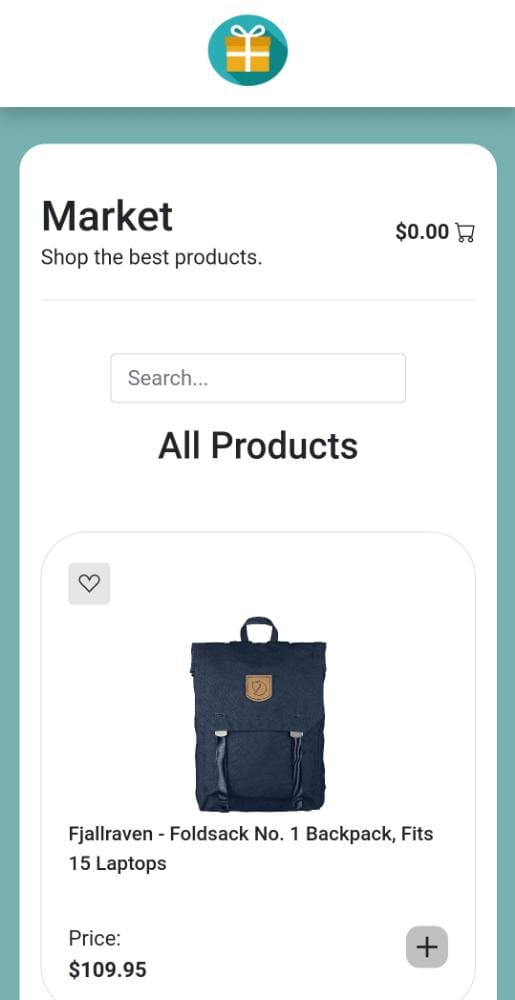
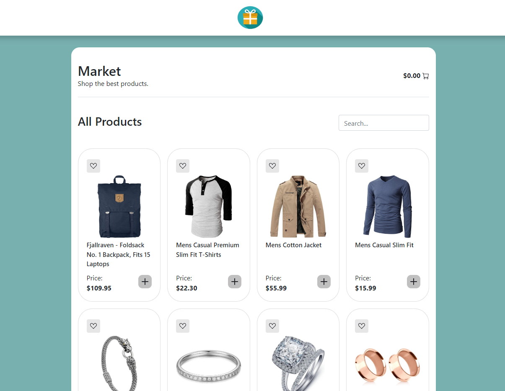

# market-vue

<h4 align="center"> 
	🚧  [Market - VUE] 🚧
</h4>

<p align="center">
 <a href="#-sobre-o-projeto">Acessar</a> •
 <a href="#-layout">Layout</a> • 
 <a href="#-como-executar-o-projeto">Como executar</a> • 
 <a href="#-tecnologias">Tecnologias</a> • 
 <a href="#-autor">Autor</a> • 
</p>

## 💻 Como acessar o projeto

<p align="center">Projeto pode ser acessado aqui <a href="https://market-vue-kohl.vercel.app/">Market - VUE</a></p>

## 🎨 Layout

### Mobile

<p align="center">
  
</p>

### Web

<p align="center" style="display: flex; align-items: flex-start; justify-content: center;">
  
</p>

---

## 🚀 Como executar o projeto

#### 🧭 Rodando a aplicação web (Frontend)

```bash

# Clone este repositório
$ git clone https://github.com/henriquelouteiro/market-vue.git

# Acesse a pasta do projeto no seu terminal/cmd
$ cd market-vue


# Caso tenha docker instalado na maquina basta fazer
$ docker-compose up

# Senão
$ npm install
$ npm run serve
```

---

## 🛠 Tecnologias

As seguintes ferramentas foram usadas na construção do projeto:

#### **Website** ([VUE] + [BOOTSTRAP4] + [DOCKER])

#### []()**Utilitários**

- Editor: **[Visual Studio Code](https://code.visualstudio.com/)**
- Commit Conventional: **[Commitlint](https://github.com/conventional-changelog/commitlint)**

---

## 🦸 Autor

<a href="https://www.linkedin.com/in/jos%C3%A9-henrique-a-louteiro-1376b5164/">
 <br />
 <sub><b>José Henrique Aguero Louteiro</b></sub></a> <a href="https://github.com/henriquelouteiro/" title="GitHub">🚀</a>
 <br />

[](https://www.linkedin.com/in/jos%C3%A9-henrique-a-louteiro-1376b5164/)
[](mailto:henrique.louteiro@hotmail.com)

---

## 📝 Licença

Este projeto esta sobe a licença [MIT](./LICENSE).

Feito por José Henrique Aguero Louteiro 👋🏽 [Entre em contato!](https://www.linkedin.com/in/jos%C3%A9-henrique-a-louteiro-1376b5164/)

---
